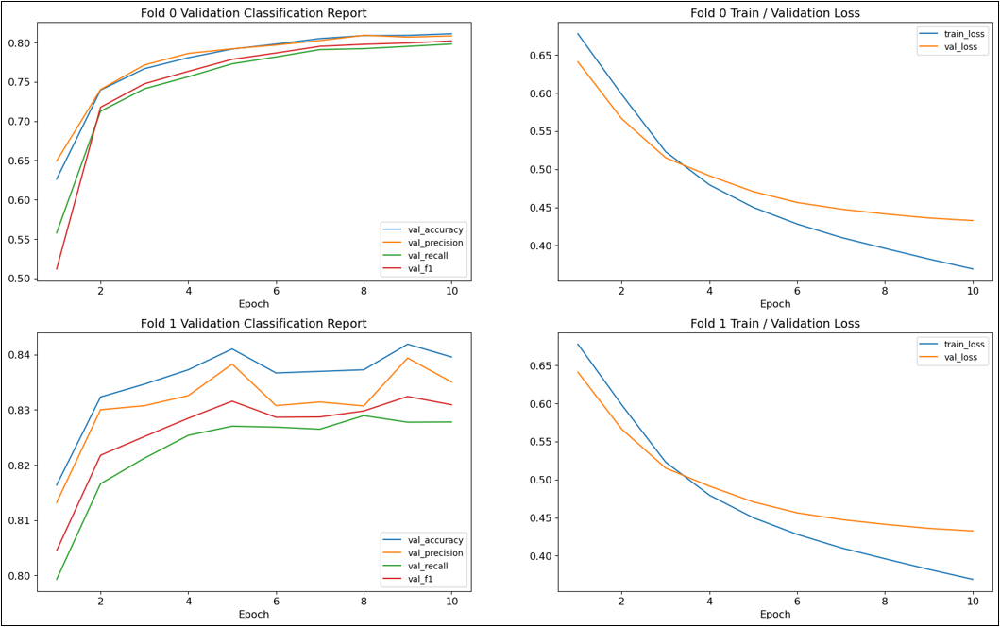

Arun Agarwal

Professor Abha Belorkar

CIS 4496 - Projects in Data Science, Honors Contract

April 30th, 2023

# Model and Performance Report

1.  **Modeling Algorithm:**

Twitter Tweets were classified as either representing a disaster (1) or not (0) using a transformer model, a type of deep learning model that adopts the mechanism of self-attention, differentially weighting the significance of each part of the input data. Such models are primarily used in Natural Language Processing (NLP) and Computer Vision (CV); thus, we use an implementation of one such transformer model called Bidirectional Encoder Representations from Transformers (BERT) from TensorFlow models (5). BERT is a family of masked-language models that is used to help computers understand the meaning of ambiguous language in text by using surrounding text to establish context. This model has been pre-trained for English on the Wikipedia and BooksCorpus. In this competition, we need to train a deep learning model on text data (that is, our task is natural language processing), and since this particular task contains the added difficulty of understanding human language ambiguity for proper classification, a BERT implementation becomes an excellent choice. This model is taken from the TensorFlow Models GitHub repository in tensorflow/models/official/nlp/bert. The model is downloaded by enabling “Internet” in the Kaggle kernel. It uses L = 12 hidden layers (Transformer blocks), a hidden size of H = 768, and A = 12 attention heads. The inputs have also been “uncased”, which means that the text has been lower-cased before tokenization into word pieces, and any accent markers have been stripped. Parameters such as lr, epochs, and batch_size are used to control the learning process. I did not have time to tune these parameters, so I simply used those found to be optimal by other competitors. There are no dense or pooling layers added after the last layer of BERT. SGD is used as an optimizer because other optimizers were found to have a hard time while converging by other competitors. 
With this model, we make sure to use cross validation to reduce overfitting and boost performance. KFold is a cross-validator that divides the dataset into k folds. In contrast, StratifiedKFold ensures that each fold of dataset has the same proportion of observations with a given label. This is great for classification problems where we want the ratio between the target classes to be the same in each fold as it is in the full dataset. I make use of stratified K fold for cross validation due to the slight class imbalance between disaster and non-disaster tweets. This version of cross validation is also chosen due to the nature of the split used to create the training and test set. That is, it was found that the training and test sets are split inside “keyword” groups, which signifies the “keyword” column is stratified when creating the two data sets. That is, every keyword group exists in both the training and test datasets, and they are from the same sample. This should then be replicated within the model to achieve optimal performance. I set shuffle to True for extra training diversity. I use two folds for StratifiedKFold. 
Input text needs to be tokenized for this model and is done using FullTokenizer from Tensorflow models (7). Tokenization is used in natural language processing to split paragraphs and sentences into smaller units that can be more easily assigned meaning. This BERT model makes use of the FullTokenizer class from tensorflow/models/official/nlp/bert/tokenization. For this tokenizer, we tune the max_seq_length parameter to tune the sequence length of text, which served to boost model performance. 
While the BERT model was the final model used for the competition and led to my best performance, it should be noted that different non-deep learning models were used in earlier phases of the project. Since we only had two hours per week to work on this competition, I needed a simple way to check model performance throughout without having to work on writing out a full deep learning model. In the beginning, I simply used a count vectorizer and Ridge Classifier with no parameter tuning and 3-fold cross validation to output some score for the competition. This served as my baseline model and was used until the EDA phase ended and preprocessing began. After the preprocessing steps were implemented, I utilized a slightly more robust model, Logistic Regression. This model also had no parameter tuning, but since this model is known for its ability to perform well in binary classification tasks, it served as a great burner model for testing out my preprocessing decisions (seeing if each decision would lead to improved model performance). The code for these models can be found within the GitHub repository under “Code/Tutorial.ipynb” and “Code/LogisticRegression.ipynb”, respectively. Since they were simple models that could run in a few seconds, the code was able to be run locally and was not tested on the Kaggle servers. 

2.  **Feature Engineering Techniques:**

As mentioned in the Data Report, the feature extraction/engineering was simply done using the apply function and various functions available in the string and nltk libraries. Therefore, rather than focus on the feature extraction techniques, I will mention the 12 features generated from these techniques. The first of these features was word_count, which was simply the number of words in the text. A graph of the distribution of this feature revealed there was a noticeable difference in words between disaster and non-disaster tweets. The next feature was unique_word_count, to get the number of unique words in the instance. This feature displayed a normal distribution with a noticeable difference between disaster and non-disaster tweets, similar to the word count. Next, stop_word_count counts the number of stop words in the text instance, measured using the stop words dictionary from nltk. The distribution was relatively the same for the two classifications except for smaller counts of stop words, in which more disaster tweets existed with less stop words. In context, this may make sense, as I would expect disaster tweets to be from sources that use more formal language. Moving on, url_count counted the number of URLs provided in the instance. As mentioned in the previous section, URLs were removed based on the extremely similar distribution between the two classifications. The next feature created was mean_word_length, which is the average character count for the words in the text instance. We would expect disaster tweets to have larger mean word lengths, which was exactly what was seen when I plotted the distribution. Therefore, this was another feature that could help to distinguish between disaster and non-disaster. We also had measured the mode word length as another feature and noticed the same pattern seen for mean_word_length. Then, char_count was simply a count of the number of characters in the text, providing similar value to combining word_count and mean_word_length. I ended up noticing that disaster tweets had a larger character count more often than non-disaster tweets, indicating the feature can provide value. Similar to url_count, punctuation_count and emoji_count get a count of the number of punctuation marks and emojis in the text, respectively. Viewing these distributions also led to the decision that their respective characters did not provide value and were removed. Moving on, hashtag_count and mention_count were counts of the number of hashtags and mentions in the text, which both did not provide additional information. The final feature created was slang_word_count to count the number of slang words in the text. In context, those tweets containing more slang are more likely to represent non-disaster tweets; however, I was struggling to find an appropriate list/dictionary that contained a lot of possible slang words, so I could not fine-tune this feature enough. It therefore could not provide any additional value. I also wanted to created features based off the unigrams, bigrams, and trigrams, as other competitors noticed interesting patterns with these, but I unfortunately ran out of time to do so. One large mistake I believe I made with these features is not including them in my final BERT model. At the time, I did not realize how much time would end up getting invested into making the BERT model work, as well as how long it would take to run one instance. Thus, by the time I finished one model run, I needed to finish up working on the code and instead spend the remainder of my time on the writing portion. For the future, I should not only try my other three processed versions of the data, but I also need to try these versions with the valuable features engineered included. A discussion of how these features serve to help the goals of this project is also provided within the Data Report.

3.  **Performance Metrics:**

This competition measures performance using F1 score, the harmonic mean of the precision and recall. F1 can be calculated as 2 * (precision * recall) / (precision + recall), where precision measures the amount of actually positive samples out of all examples predicted positive and recall measures how many samples were correctly classified positive out of all the actual positives that exist. We measure precision as TP/(TP + FP) and recall as TP/(TP+FN). TP (true positive) is predicted positive/1 and actually positive/1, FP (fall positive) is predicted positive/1 and actually negative/0, TN (true negative) is predicted negative/0 and actually negative/0, and FN (false negative) is predicted negative/0 and actually positive/1. F1 score makes sense for this competition task as it is a very common scoring metric for classification models. However, the score is not usually that informative without considering Accuracy, Precision, and Recall as well because the two classes here are almost balanced, making it harder to tell which class is more difficult to predict. Thus, we output scores for all four metrics after every epoch for the given training and validation sets. 
	It should be noted that this competition has perfect F1 scores on the leaderboard due to the test set labels being publicly available online. That is, people cheat in their submissions and just submit the correct solution as their own. However, considering this is a “Getting Started”/Learning competition with no prize attached to it, it does not really matter how one places in the competition. Rather, one should aim for scores in the mid 80s, as those top performing competitors that do not cheat achieve such a score. It should also be noted that there is a two-month rolling window for submissions into this competition, so those competitors that decide to cheat get flushed out every few months. One final thing to note is that this competition has only one leaderboard; that is, there is no separation between private and public scores. At the end of the day, this does not really affect what anyone would decide to do, as this is still a “Getting Started” competition. 

4.  **Model Performance Evaluation:**

We discuss our model performance through each stage of the project. First, for our baseline/tutorial model, we did not upload our code or submission to Kaggle as we wanted to focus on getting the code to run locally first. Thus, we outputted F1 scores for the training test using 3-fold cross validation. The three F1 scores outputted were 0.594, 0.565, and 0.641, leading to an average F1 score of 0.60. That is, with no preprocessing nor cleaning of the data, we still managed to achieve an F1 score of approximately 0.60. Since the train and test data come from the same sample, it is fair to assume that we would see a similar score if the code was submitted to the competition. 
	Next, for our Logistic Regression model that made use of some preprocessing techniques, we again use 3-fold cross validation and output F1 scores for each of our 4 created processed datasets (as mentioned in the Data Report). For the dataset with mislabels and duplicates kept in, we saw F1 scores of 0.61169102, 0.54718876, and 0.60039761. For the dataset with mislabels but no duplicates, we saw F1 scores of 0.5789153, 0.53946621, and 0.59375. For the dataset with no mislabels but duplicates kept in, we saw F1 scores of 0.62434418, 0.54313425, and  0.62040816. Finally, for the dataset with no mislabels and no duplicates (which also gets used in our final model), we saw F1 scores of 0.5767098, 0.53946621, and 0.5949214. Averaging the three scores for each dataset, I find the best performing one to be the one with no mislabels but duplicates kept in, which makes sense considering a model is likely to do better without contradicting instances. The higher average score though could most likely be attributed to overfitting, since we decide to keep duplicates in; thus, if this cleaning methodology was used on the test dataset, the F1 score would most likely be lower than what the dataset with no mislabels and no duplicates could have outputted. Thus, I decided to use the one with neither mislabels nor duplicates in the BERT model. If I had more time available, I would certainly have tried the other three as well. 
	Finally, we discuss performance of the BERT model. While the training and validation metric scores were outputted for each epoch after running the model code, these specific scores will not be discussed here. Instead, to better evaluate the model performance, I briefly discuss the charts I created of the validation set accuracy, precision, recall, and F1 score for the 2 folds over the 10 epochs and the charts of the train and validation for the 2 folds over the 10 epochs (Figure 1). 

Figure 1: Charts of Validation Accuracy, Precision, Recall, and F1 for 2 Folds Over 10 Epochs (Left) and Charts of Train and Validation Loss for 2 Folds Over 10 Epochs (Right)

From the graphs of the validation metric scores (Figure 1, Left charts), we notice that, for the first fold, the metrics follow a similar pattern of rapid increase in score in the first few epochs and then gradual decline in performance improvement as the number of epochs increases. The scores continue to increase all the way until epoch 10. The fact that these scores stay in a relatively similar area usually suggests that our model is not overfitting. For the second fold, the metric scores are a bit further apart, but still follow similar patterns of spike in the beginning, and gradual increase afterward; however, there are also two periods of spiking in scores that occur in the second fold, at epochs 5 and 9. I could not figure out why this may have happened, but I believe if I had more time to analyze the model and the results, I could understand what may have caused this. In terms of the train and validation loss graphs (Figure 1, right charts), we note that for both folds the pattern is almost identical of a fast decline (improvement) in loss and a gradual decline afterward. This type of decrease in loss is what we hope to see in our model as the amount of epochs trained on increases. We also hope that the train and validation loss are relatively similar, which is also the case, as shown by the two curves on each of the right plots. 
Overall, I achieved a final F1 score of 0.812, placing me 311th/1228 on the leaderboard, or approximately in the 25th percentile. This placement should not be taken seriously, though, due to the large number of competitors who cheat and get a perfect score. Since the best scores are in the mid 80s, I am almost amongst the best performing competitors, even with only spending minimal time on this project. Therefore, with consideration of my time constraint, I would say my model did extremely well. 

5.  **Future Steps/Model Improvements:**

While not mentioned in the instructions for the model and performance report, I wanted to provide a brief overview of what future steps for this project would include, since I did not have time to complete all the steps I wanted to. First, as mentioned prior, I would try including the features I engineered into my BERT model to see if they would boost performance. I would do variations of the inclusion of these features as well (potentially even doing PCA) to also measure the performance changes. Next, I would also try the other three datasets I created, as mentioned before. Moving on, I would experiment more with back translation. The previous team for this course tried to make use of this technique–which translates the text into another language and back into English–but ran into issues with runtime. I personally could not get their function to run with my Python library versions, and due to my time constraints, I decided to put this technique on the back burner. I am certainly interested to see how it could affect performance, however. The next thing I would like to do in the future is to experiment more with BERT model parameters. For almost all parameters fed into this model, I just used those values being used by top competitors in the competition due to my lack of time to play around with them. Evidently, hyperparameter tuning can lead to model performance improvement and thus should be done with my processed version of the data. Finally, I would like to try other deep learning models in the future to 1) learn about other models that would be good to use for such a NLP problem, 2) try to code and successfully run other deep learning models, and 3) see how they change the model performance. 

**References:**
1. [Previous Group GitHub](https://github.com/bmagdamo1/DisasterTweets)
2. [Gunes Evitan Kaggle Competitor Code](https://www.kaggle.com/code/gunesevitan/nlp-with-disaster-tweets-eda-cleaning-and-bert)
3. [NLP Disaster Tweet Data Source](https://www.figure-eight.com/data-for-everyone/)
4. [NLP Disaster Tweet Kaggle Competition](https://www.kaggle.com/competitions/nlp-getting-started/overview/faq)
5. [Transformers Modeling BERT](https://huggingface.co/transformers/v3.5.1/_modules/transformers/modeling_bert.html)
6. [How To Train a BERT Model - Towards Data Science](https://towardsdatascience.com/how-to-train-a-bert-model-from-scratch-72cfce554fc6)
7. [GitHub NLP Tokenization Code](https://github.com/tensorflow/models/blob/master/official/nlp/tools/tokenization.py)
8. [My GitHub Repository](https://github.com/aagarwal17/NLPDisasterTweets)

